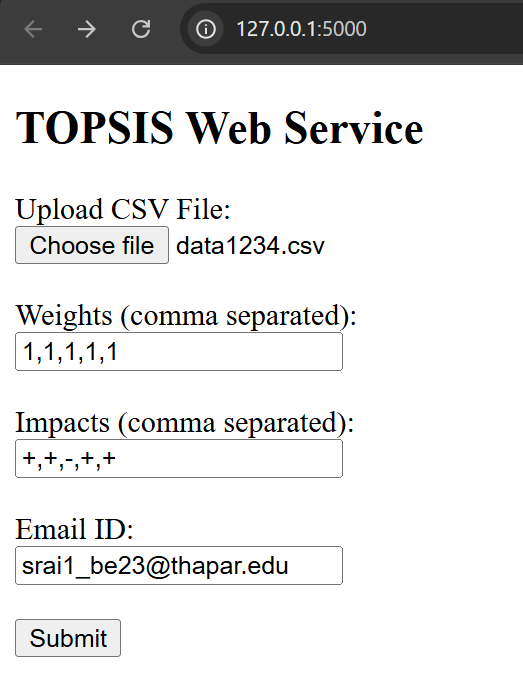

# 📊 TOPSIS Assignment – Python Implementation

## 📌 Assignment Overview

This repository contains my implementation of the **TOPSIS (Technique for Order Preference by Similarity to Ideal Solution)** method as part of the assignment.

TOPSIS is a **multi-criteria decision-making (MCDM)** technique used to rank alternatives based on their distance from an **ideal best** and an **ideal worst** solution. The alternative closest to the ideal best and farthest from the ideal worst is ranked highest.

The assignment is implemented using **Python 🐍** and includes:
- A standalone Python script
- Jupyter notebooks for development and testing
- Input and output CSV files
- A published Python package on PyPI

---

## 📁 Repository Structure
```
├── README.md
├── Topsis_Assignment.py
├── Topsis_Assignment.ipynb
├── Package_Test.ipynb
├── data1234.csv
├── output.csv
```

---

## 🧾 File Description

- **Topsis_Assignment.py**  
  Python script implementing the TOPSIS algorithm.

- **Topsis_Assignment.ipynb**  
  Jupyter Notebook version of the TOPSIS implementation for step-by-step execution and understanding.

- **Package_Test.ipynb**  
  Notebook used to test the TOPSIS Python package after installation from PyPI.

- **data1234.csv**  
  Sample input dataset used for TOPSIS evaluation.

- **output.csv**  
  Output file generated after applying the TOPSIS method, containing scores and ranks.

---

## ⚙️ Methodology Used

The TOPSIS algorithm in this assignment follows these steps:

1️⃣ Read the input data from a CSV file  
2️⃣ Normalize the decision matrix  
3️⃣ Apply weights to the normalized matrix  
4️⃣ Identify ideal best and ideal worst values  
5️⃣ Calculate distances from ideal solutions  
6️⃣ Compute TOPSIS score for each alternative  
7️⃣ Rank alternatives based on the score  

---

## 📄 Input File Format

- Input file must be in **CSV format**
- **First column** contains names of alternatives
- Remaining columns contain **numeric criteria values**
- Minimum **three columns** are required

### Example Input
```
Fund Name,P1,P2,P3,P4
M1,0.67,0.45,6.5,42.6
M2,0.60,0.36,3.6,53.3
M3,0.82,0.67,3.8,63.1
```

---

## 📤 Output File Format

The output CSV file contains:
- ✅ **Topsis Score** – Relative closeness to the ideal solution
- 🏆 **Rank** – Ranking of alternatives based on TOPSIS score

📌 Higher TOPSIS score indicates a better alternative.

---

## 🚀 Python Package (PyPI)

As part of the assignment, the TOPSIS implementation was also converted into a **Python package** and published on **PyPI**.

### 📦 Package Name
```
Topsis-Sameer-102303773
```


### 📥 Installation
```bash
pip install Topsis-Sameer-102303773
topsis input.csv "1,1,1,2" "+,+,-,+" output.csv
```
---

## 🌐 Web Service 

In addition to the command-line and packaged implementation, this assignment also includes a **web-based TOPSIS service** developed using **Flask**.

The web service allows users to:
- Upload a CSV file  
- Provide weights and impacts  
- Enter an email address  
- Receive the TOPSIS result file via **email**

The server processes the TOPSIS algorithm on the backend and sends the generated output CSV file to the user.  
The working of the web service is demonstrated through screenshots included in the repository.

---

### 🖥️ Web Interface Screenshot  
<!-- Replace img1.png with your actual UI screenshot -->


---

### 📧 Result Email Screenshot  
<!-- Replace img2.png with your actual email screenshot -->


---
###❗ Error Handling

The implementation includes validation for:

Incorrect number of command-line arguments

Input file not found

Non-numeric values in criteria columns

Mismatch in number of weights, impacts, and criteria

Invalid impact values (only + or - allowed)
---

###📚 Technologies Used

Python 3.x 🐍

Pandas

NumPy

Jupyter Notebook

PyPI

###🏁 Conclusion

This repository demonstrates a complete and practical implementation of the TOPSIS decision-making technique using Python. It fulfills all requirements of the assignment, including algorithm implementation, testing, and packaging for reuse.

